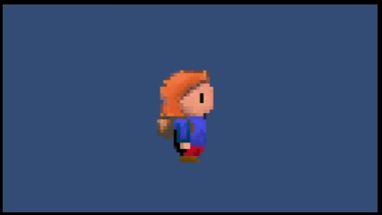

# 🎮 Videojuego 2D — Tutoriales y Evidencias de Avances

<p align="center">
  
</p>

> **Repositorio oficial** del desarrollo de un videojuego 2D.  
> Incluye código fuente, documentación, y una colección de tutoriales prácticos con evidencias gráficas.

---

## 🧭 Contenido del Proyecto
| Sección | Descripción |
|----------|--------------|
| 🎯 [Descripción del Proyecto](#descripción-del-proyecto) | Propósito general y objetivos. |
| 🗂️ [Estructura del Repositorio](#estructura-del-repositorio) | Organización interna de carpetas. |
| ⚙️ [Requisitos](#requisitos) | Herramientas necesarias para ejecutar el proyecto. |
| 🧩 [Tutoriales y Evidencias](#tutoriales-y-evidencias) | Avances documentados con ejemplos visuales. |
| 📝 [Licencia](#licencia) | Tipo de licencia aplicable. |

---

## 🧱 Descripción del Proyecto
Este proyecto documenta el desarrollo paso a paso de un **videojuego 2D en Unity**, abarcando desde la programación del movimiento del jugador hasta la implementación de interfaz, sonido e inteligencia artificial.

Cada tutorial contiene:
- Una breve **descripción de la etapa de desarrollo.**
- Una **vista previa en GIF.**
- Un **enlace al documento completo de evidencia.**

---

## 📁 Estructura del Repositorio

```
📦 Proyecto Videojuego 2D
├── Assets/               → Recursos del juego (sprites, sonidos, scripts)
├── Packages/             → Paquetes utilizados por Unity
├── ProjectSettings/      → Configuración del entorno Unity
├── screenshots/          → Capturas y GIFs de evidencias
├── README.md             → Documento actual
└── .gitignore            → Archivos ignorados por Git
```

---

## ⚙️ Requisitos

- [Unity Hub](https://unity.com/) (versión recomendada 2022 o superior)  
- [Visual Studio Code](https://code.visualstudio.com/) o [Visual Studio Community](https://visualstudio.microsoft.com/)  
- [Git](https://git-scm.com/) para control de versiones  

---

## 🧩 Tutoriales y Evidencias

> Cada tutorial representa un **avance significativo** dentro del desarrollo del videojuego.  
> Las vistas previas (GIFs) están dispuestas en formato de tarjetas con íconos y estilos para una lectura más atractiva.

| 🎮 Tutorial | 📝 Descripción | 🖼️ Vista Previa | 🔗 Enlace |
|--------------|----------------|------------------|------------|
| **1 — Movimiento del Jugador** | Implementación del control básico y detección de colisiones. |  | [Ver Evidencia](https://docs.google.com/document/d/1XQ5JF0nqKC-NTVHdymEi49wHev40KF1fEdRN8sVhJpE/edit?usp=drive_link) |
| **2 — Creación del Escenario** | Construcción del entorno del juego y uso de Tilemap. |  | [Ver Evidencia](https://drive.google.com/...) |
| **3 — Sistema de Daño y Vida** | Programación de daño, puntos de vida y animaciones. |  | [Ver Evidencia](https://drive.google.com/...) |
| **4 — Sonido y Música** | Implementación de efectos, música y control de volumen. |  | [Ver Evidencia](https://drive.google.com/...) |
| **5 — Interfaz de Usuario (UI)** | Creación del menú principal, HUD y pantalla de pausa. |  | [Ver Evidencia](https://drive.google.com/...) |
| **6 — Enemigos e IA Básica** | Lógica de movimiento, detección y ataque. |  | [Ver Evidencia](https://drive.google.com/...) |
| **7 — Pantalla de Fin y Guardado** | Sistema de guardado y pantalla de fin. |  | [Ver Evidencia](https://drive.google.com/...) |

---

## 🧠 Tips de Presentación

💡 **Consejo:** Puedes mejorar la apariencia del README en GitHub usando un tema oscuro y GIFs con fondo transparente o colores planos.  
También puedes usar badges decorativos, por ejemplo:

[](https://unity.com/)
[](https://opensource.org/licenses/MIT)
[](#)

---

## 📝 Licencia
Este proyecto se distribuye bajo licencia [MIT](https://opensource.org/licenses/MIT).  
Eres libre de usar, modificar y distribuir el código siempre que se mantenga el crédito correspondiente.

---

**Autor:** *[Tu Nombre]*  
📅 *Repositorio actualizado el:* `$(date +%Y-%m-%d)`  
🌐 *Universidad / Proyecto Académico*
